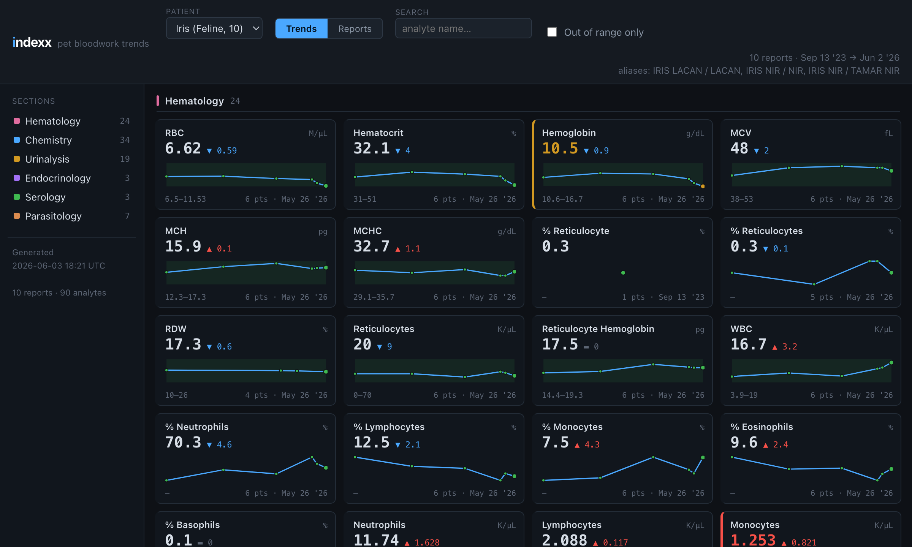

# pethud

An analyzer for **IDEXX VetConnect PLUS** pet bloodwork PDFs. It parses lab
reports and shows trends in each value over time. It runs **two ways from one
codebase**: a Ruby CLI (parses to SQLite + JSON), and a **fully in-browser
build** that parses PDFs client-side and stores them in your browser — so it can
be hosted free on any static host with no server. Both produce the identical
viewer and data, kept in lockstep by a parity test.

Built for tracking one cat (or a few pets) across years of labwork — basic
chemistry, hematology, urinalysis, thyroid, fecal/antigen panels, serology —
where not every report contains every section.



## What it does

- **Parses** every section of an IDEXX report (Hematology, Chemistry,
  Urinalysis, Endocrinology, Serology, Parasitology, …) using word-coordinate
  geometry, so it's robust to the layout differences between full senior
  screens, chemistry-only panels, and in-house Catalyst analyzer printouts.
- **Stores** results in a normalized SQLite schema (long-format measurements),
  idempotently keyed by file hash — re-importing a file replaces its rows.
- **Aliases** patients: the same animal recorded under different owners or
  clinic systems is merged into one profile (see [Patient aliasing](#patient-aliasing)).
- **Exports** a structured JSON document per report and a single `web/data.js`
  for the viewer.
- **Visualizes** trends: a dense small-multiples grid of sparklines with
  reference bands, flag coloring, deltas, a detail chart with hover, and a
  per-report "out of range" summary.
- **Explains** results: sourced, conservative clinical context above each
  metric's chart, related-metric links, and disease-specific panels (see
  [Medical context](#medical-context)).
- **Imports** new reports by drag-and-drop in the browser (when served) or via
  the CLI.

## Run it free in your browser (no backend)

The `web/` folder is a complete static app: it parses dropped PDFs with a
vendored, pinned **pdf.js**, stores the originals + parsed data in **IndexedDB**,
rebuilds the dataset in memory, and renders it. No Ruby, no server, no database.

Try it locally (needs an http server — ES modules and Web Workers don't run from
`file://`):

```sh
cd web && python3 -m http.server 8000   # then open http://localhost:8000
```

Drag your IDEXX PDFs onto the page. Everything is processed and kept **locally in
your browser** — nothing is uploaded. Since you keep your PDF files, you can
re-import them any time (the app also retains them in IndexedDB for reprocessing).

**Deploy free to GitHub Pages:** push to `main` — `.github/workflows/pages.yml`
publishes `web/`. (Enable Pages with source "GitHub Actions".) Any static host
works: Netlify, Cloudflare Pages, S3, etc. — just serve `web/`.

**The one dependency, handled responsibly.** Client-side PDF parsing needs a PDF
library; pethud vendors a **pinned** pdf.js in `web/vendor/` (offline, no CDN).
Updates aren't auto-pulled at runtime (a floating version could silently break
parsing or ship unreviewed code). Instead, Dependabot opens a PR when pdf.js
updates and the **parity test** (below) runs in CI to prove the new version still
parses the sample reports identically — then you merge. To update by hand:
`npm update pdfjs-dist && npm run vendor-pdfjs && npm run parity`.

### How the two builds stay identical

The browser modules in `web/lib/` (extract, parser, resolver, aggregate) are a
port of the Ruby pipeline. `test/parity.mjs` re-parses all 10 sample PDFs with
the JS code and diffs the result against the canonical Ruby output
(`test/fixtures/`): numeric values and metadata must match byte-for-byte.

```sh
npm ci && npm run parity     # Node >= 22.13
```

When you change the medical content (`config/knowledge/*.yml`) or alias rules
(`config/patients.json`), regenerate the static config the browser fetches:

```sh
bin/pethud build-web         # writes web/knowledge.json + web/patients.json
```

## Requirements

- **Ruby** ≥ 3.1 (developed on 3.4)
- **poppler** for `pdftotext` — `brew install poppler` / `apt-get install poppler-utils`
- The **sqlite3** gem (the only runtime gem):

```sh
bundle install        # or: gem install sqlite3
```

Everything else is Ruby standard library. The web viewer has **no**
dependencies — no build step, no framework, no CDN.

## CLI

```sh
bin/pethud import samples/                 # import every PDF in a folder
bin/pethud import a.pdf b.pdf              # import specific files
bin/pethud import a.pdf --force            # re-import (replace) existing
bin/pethud reimport                        # re-import samples/ + inbox/
bin/pethud export                          # rebuild all JSON + web/data.js
bin/pethud list patients                   # corpus overview
bin/pethud list reports
bin/pethud list analytes
bin/pethud knowledge                       # validate the medical-context config
bin/pethud serve --port 8787 --open        # local viewer + drag-drop import
bin/pethud reset --force                   # delete the database + exports
```

Set `PETHUD_DB` to point at a different database file.

## The viewer

The same viewer renders in three setups:

1. **Browser build** (recommended, no backend) — serve `web/` over http (see
   [above](#run-it-free-in-your-browser-no-backend)). Parses dropped PDFs
   client-side, persists to IndexedDB.
2. **Ruby served** — `bin/pethud serve` runs a tiny stdlib HTTP server at
   `http://127.0.0.1:8787/`; dropping a PDF parses it server-side with poppler
   and refreshes live. Useful if you prefer the Ruby parser or batch CLI.
3. **Ruby static** — `bin/pethud export` writes `web/data.js`; the viewer can
   load that instead of IndexedDB.

Viewer features:

- **Trends** — cards grouped by section. Each shows the latest value
  (colored by H/L flag), the change from the previous result, an inline
  sparkline with the reference range shaded, and the reference + point count.
  Qualitative tests (e.g. urine color, antigen panels) show a value with a
  history of past results.
- **Detail** — click any card for a full chart with axes, reference band,
  hover tooltip, and a date-by-date table.
- **Missing / stale data** — charts mark report dates where a test *wasn't*
  run (dashed gaps), and the time axis extends to your latest report so a
  trailing gap is visible. When a metric wasn't included in the last couple of
  reports, its card and detail page say so ("last measured …; treat as
  historical") — so an older value isn't mistaken for a current one.
- **Reports** — one card per visit listing every out-of-range value.
- Filters: section toggles (sidebar), analyte search, "out of range only",
  patient selector. Deep links: `#reports`, `#a=<analyteId>`, `#c=<condition>`.
- Theme: follows your system light/dark setting by default, with a manual
  override (auto / light / dark) in the bottom-left corner. The choice is
  remembered; `?theme=light|dark|auto` forces it for a given link.

## Medical context

The viewer can show educational context for disease-relevant metrics. **This is
not veterinary advice or a diagnosis** — a disclaimer says so on every medical
surface, and the goal is to help you read trends and ask better questions.

What you get:

- **Per-metric context** above the chart: a plain-language summary, what an
  elevated/low result *may* mean, and — highlighted when the value is out of
  range — an "interpret in isolation" caveat (many abnormals only matter
  alongside related values). Each carries "Learn more" links to the cited
  sources.
- **How values change over time**: each metric shows *what moves it*
  (hydration, a recent meal, stress, sample handling, medication, IV fluids,
  diet) and its typical *pace & monitoring* cadence, plus a collapsible primer
  on why a single dip or spike is often just noise (analytical + biological
  variation / the reference-change concept) — so trends, not one reading, drive
  conclusions. All cited (Cornell eClinpath, Baral et al. biological-variation
  studies, IRIS).
- **Related metrics**: clickable chips for the values that should be read
  together (color-coded by whether they're also out of range), built from an
  explicit relationship graph.
- **Conditions view**: focused panels for the diseases that matter in cats —
  **CKD**, **Hyperthyroidism**, **Heart Disease**, **IBD / Small Cell
  Lymphoma**, **Systemic Hypertension**, **Diabetes Mellitus**, **Neoplasia**,
  **Osteoarthritis**, **Cognitive Dysfunction**, and **Dental Disease**. Each
  shows that condition's metrics, names what's *not* in your reports, and — for
  CKD — an IRIS staging orientation for the latest creatinine/SDMA. The ones
  that bloodwork can't detect (arthritis, dental, cognitive dysfunction) say so
  plainly and instead list **signs to watch at home** and how they're diagnosed.
- **Age-aware vigilance**: a banner at the top of Trends shows the cat's current
  life stage (per the AAHA/AAFP Feline Life Stage Guidelines) and the conditions
  worth watching for at that age, linking to the relevant condition panels. Age-
  relevant conditions are also dotted in the Conditions view.

### Auditability

All of this lives in flat, citation-bearing config under `config/knowledge/` —
no medical logic is buried in code:

| file               | contents                                                   |
| ------------------ | ---------------------------------------------------------- |
| `sources.yml`      | every cited source (name, publisher, tier, URL)            |
| `analytes.yml`     | per-metric context, each line citing source ids            |
| `relationships.yml`| explicit `between` edges with a reason + citation          |
| `conditions.yml`   | disease panels: member metrics, roles, missing markers, IRIS staging |
| `life_stages.yml`  | age bands → life stage → conditions to watch (linking to the panels above) + screening, cited |

Every claim references a source id; nothing renders without provenance. Run:

```sh
bin/pethud knowledge
```

to validate the whole base — it fails loudly if any analyte key doesn't match a
real metric or any citation id doesn't resolve. Sources span Cornell eClinpath,
IRIS, AAFP/ACVIM guidelines, peer-reviewed JVIM, the Merck Veterinary Manual,
and IDEXX reference material; each was verified reachable when added.

To correct or extend the content, edit the YAML (ideally with your vet) and
re-run `bin/pethud export`. Treat it as a starting point for discussion, not a
clinical authority.

## Patient aliasing

`config/patients.json` maps report identities to a canonical patient. A report
matches a patient if **any** of: its patient external id is in `external_ids`,
its (uppercased) pet name is in `names`, or its owner is in `owners`.

```json
{
  "patients": [
    {
      "slug": "iris", "name": "Iris", "species": "Feline",
      "match": {
        "names": ["IRIS"],
        "owners": ["REED", "PARK", "MAYA PARK"],
        "external_ids": ["900901", "900902"]
      }
    }
  ]
}
```

Reports that match no rule get an auto-created patient keyed by their external
id — nothing is silently merged or dropped. After editing the config, run
`bin/pethud reimport --force` to regroup.

## Data model

| table                | purpose                                               |
| -------------------- | ----------------------------------------------------- |
| `patients`           | canonical patient (slug, name, species)               |
| `patient_identities` | every (name, owner, external id) seen → patient (audit)|
| `reports`            | one row per imported PDF + its header metadata        |
| `analytes`           | catalog of distinct tests `(section, name)`           |
| `measurements`       | long-format: one row per analyte per report           |
| `section_notes`      | free-text annotations (clinical history, legends)     |

`measurements` carries the parsed value, qualifier (`<`/`>`), unit, reference
low/high, printed flag, and a numeric flag, so trend queries are a simple
`WHERE patient_id = ? AND analyte_id = ? ORDER BY result_date`.

## How parsing works

Positioned words (from `pdftotext -tsv` in Ruby, or pdf.js `getTextContent()` in
the browser) are grouped into visual lines. A per-section state machine reads
each section's own `TEST / RESULT / REFERENCE VALUE` header to derive column
x-anchors, then slices each row into name / result / reference / flag columns.
Wrapped analyte names are stitched back together using line-gap detection,
prior-comparison columns are excluded, and free-text prose is routed to notes.

The Ruby parser (`lib/pethud/report_parser.rb`) is canonical; the browser parser
(`web/lib/parser.js`) is a port held to it by the parity test. pdf.js reproduces
poppler's word coordinates to sub-pixel accuracy, so the same column logic works
for both.

## Project layout

```
bin/pethud              CLI entry point
lib/pethud/
  pdf_extractor.rb      pdftotext -tsv -> positioned words/lines
  report_parser.rb      words -> structured report
  patient_resolver.rb   identity -> canonical patient (aliasing)
  database.rb           SQLite schema + idempotent import
  knowledge.rb          loads + validates the medical-context config
  exporter.rb           per-report JSON + web/data.js
  importer.rb           parse -> resolve -> store orchestration
  server.rb             stdlib HTTP server (viewer + upload)
  cli.rb                subcommand dispatch
  cli.rb (cont.)        + build-web (emit web/{knowledge,patients}.json)
config/patients.json    alias rules
config/knowledge/       cited medical-context config (sources, analytes, relationships, conditions)
web/                    viewer + the in-browser build
  index.html style.css app.js   viewer (shared by all setups)
  lib/                  browser pipeline: extract, parser, resolver, aggregate, db, process (ES modules)
  vendor/pdf*.mjs       vendored, pinned pdf.js
  knowledge.json patients.json   static config the browser fetches (generated by build-web)
test/parity.mjs         JS-parser ↔ Ruby parity test (Node); skips if samples/ is empty
test/fixtures/          frozen canonical Ruby output (gitignored — local only)
scripts/vendor-pdfjs.mjs  copy pinned pdf.js into web/vendor/
.github/workflows/      parity (CI gate) + Pages deploy; dependabot.yml
exports/reports/        generated per-report JSON
db/pethud.sqlite3       generated database
samples/                your IDEXX PDFs (gitignored — real reports stay local)
```

**Sample data.** Two kinds live in `samples/`:

- `samples/demo-*.pdf` — **committed, fully synthetic** reports (fictional pets,
  owners, and clinics) with designed value trends for the conditions pethud
  highlights: CKD progression (Willow), treated hyperthyroidism (Otis), a stable
  healthy cat (Cleo), controlled diabetes (Mochi), HCM screening with a rising
  Cardiopet proBNP (Juniper), IBD / small-cell lymphoma with falling albumin +
  A:G and low cobalamin (Sage), and a healthy dog with canine reference intervals
  (Baxter). Drag them onto the web app, or `bin/pethud import
  samples/`. Regenerate with `bundle install --with tools && ruby scripts/make_sample_pdfs.rb`
  (uses Prawn to place text at the exact point coordinates a real report uses, so
  the parser ingests them unchanged).
- `samples/*.pdf` (your own real reports) and `test/fixtures/*.json` are
  **gitignored** — they hold real owner names/clinic/values, so the repo can be
  public without exposing them. Drop your PDFs in `samples/`, then
  `bin/pethud reimport && bin/pethud export && cp exports/reports/*.json test/fixtures/`
  to (re)create fixtures and run `npm run parity` locally. With no real samples
  present, the parity gate skips cleanly (CI still enforces the pinned-pdf.js check).
